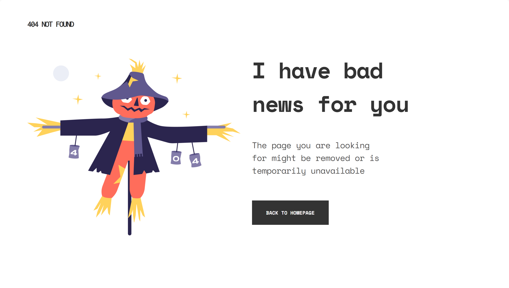

<h1 align="center">404 Not Found Page</h1>

   Solution for a challenge from  <a href="http://devchallenges.io" target="_blank">Devchallenges.io</a>.

  <h3>
    <a href="https://sass-404-not-found.netlify.app/">
      Demo
    </a>
     | 
    <a href="https://devchallenges.io/solutions/VXKCSGXRv2akxubBkfrh">
      Solution
    </a>
     | 
    <a href="https://devchallenges.io/challenges/wBunSb7FPrIepJZAg0sY">
      Challenge
    </a>
  </h3>

## The challenge

User story: I can see a page following the given design

## Built With

- [Sass](https://sass-lang.com/)

## Author

- GitHub [@amansgz](https://github.com/amansgz)
- DevChallenges [@amansgz](https://devchallenges.io/portfolio/amansgz)
